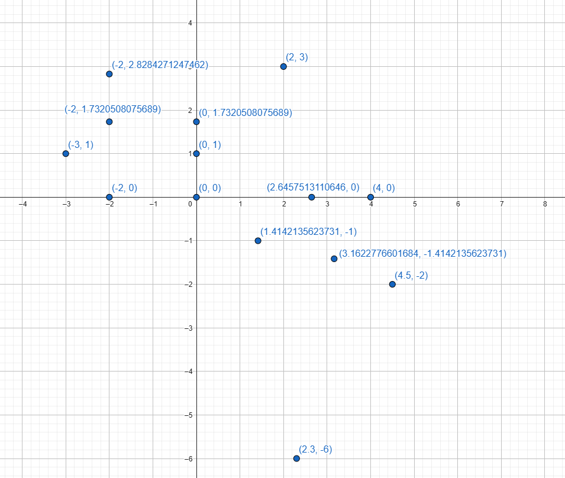
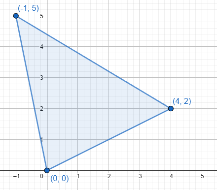
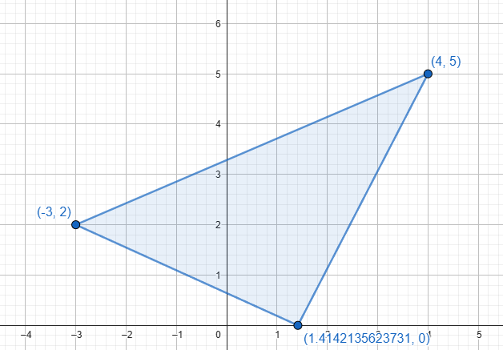
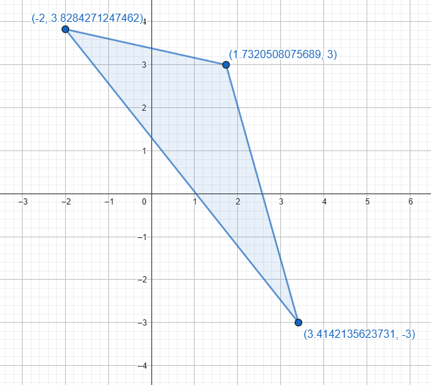
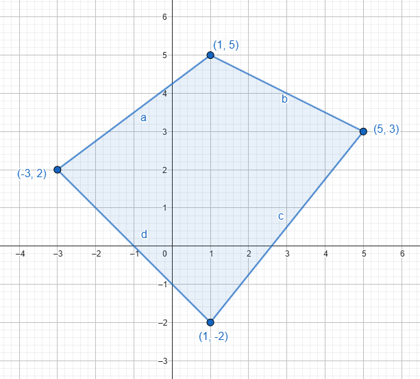
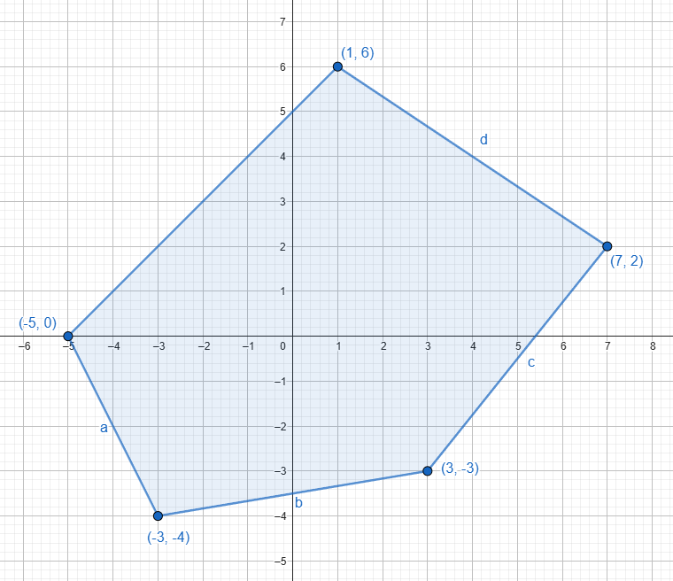

# 01 - Coordenadas Rectangulares

## Distancia entre dos puntos

1. Representar los puntos de coordenadas: $(2, 3)$, $(4, 0)$, $(-3, 1)$, $(\sqrt{2}, -1)$, $(-2, 0)$, $(-2, \sqrt{3})$, $(0, 1)$, $(-2, \sqrt{8})$, $(\sqrt{7}, 0)$, $(0, 0)$, $(4.5, -2)$, $(\sqrt{10}, -\sqrt{2})$, $(0, \sqrt{3})$, $(2.3, -6)$.

2. Representar los triángulos de vértices:

a. $(0, 0)$, $(-1, 5)$, $(4, 2)$

b. $(\sqrt{2}, 0)$, $(4, 5)$, $(-3, 2)$

c. $(2 + \sqrt{2}, -3)$, $(\sqrt{3}, 3)$, $(-2, 1 + \sqrt{8})$

3. Representar los polígonos de vértices:

a. $(-3, 2)$, $(1, 5)$, $(5, 3)$, $(1, -2)$

b. $(-5, 0)$, $(-3, -4)$, $(3, -3)$, $(7, 2)$, $(1, 6)$

4. Hallar la distancia entre los pares de puntos cuyas coordenadas son:

$$
d = \sqrt{(x_2 - x_1)^2 + (y_2 - y_1)^2}
$$

a. $(4, 1)$, $(3, -2)$

$$ d = \sqrt{(3 - 4)^2 + (-2 - 1)^2} $$
$$ d = \sqrt{(-1)^2 + (-3)^2} $$
$$ d = \sqrt{1 + 9} $$
$$ d = \sqrt{10} $$

b. $(-7, 4)$, $(1, -11)$

$$ d = \sqrt{(1 - (-7))^2 + (-11 - 4)^2} $$
$$ d = \sqrt{8^2 + (-15)^2} $$
$$ d = \sqrt{64 + 225} $$
$$ d = \sqrt{289} = 17 $$

c. $(0, 3)$, $(-4, 1)$

$$ d = \sqrt{(-4 - 0)^2 + (1 - 3)^2} $$
$$ d = \sqrt{(-4)^2 + (-2)^2} $$
$$ d = \sqrt{16 + 4} $$
$$ d = \sqrt{20} = 2\sqrt{5} $$

d. $(-1, -5)$, $(2, -3)$

$$ d = \sqrt{(2 - (-1))^2 + (-3 - (-5))^2} $$
$$ d = \sqrt{3^2 + 2^2} $$
$$ d = \sqrt{9 + 4} $$
$$ d = \sqrt{13} $$

e. $(2, -6)$, $(2, -2)$

$$ d = \sqrt{(2 - 2)^2 + (-2 - (-6))^2} $$
$$ d = \sqrt{0^2 + 4^2} $$
$$ d = \sqrt{0 + 16} $$
$$ d = \sqrt{16} = 4 $$

f. $(-3, 1)$, $(3, -1)$

$$ d = \sqrt{(3 - (-3))^2 + (-1 - 1)^2} $$
$$ d = \sqrt{6^2 + (-2)^2} $$
$$ d = \sqrt{36 + 4} $$
$$ d = \sqrt{40} = 2\sqrt{10} $$

5. Hallar el perímetro de los triángulos cuyos vertices son:

a. $(-2, 5)$, $(4, 3)$, $(7, -2)$

$$ a = \sqrt{(4 - (-2))^2 + (3 - 5)^2} = 2\sqrt{10} $$
$$ b = \sqrt{(7 - 4)^2 + (-2 - 3)^2} = \sqrt{34} $$
$$ c = \sqrt{(-2 - 7)^2 + (5 - (-2))^2} = \sqrt{130} $$
$$ p = a + b + c = 2\sqrt{10} + \sqrt{34} + \sqrt{130} \approx 23.56 $$

b. $(0, 4)$, $(-4, 1)$, $(3, -3)$

$$ a = \sqrt{(-4 - 0)^2 + (1 - 4)^2} = 5 $$
$$ b = \sqrt{(3 - (-4))^2 + (-3 - 1)^2} = \sqrt{65} $$
$$ c = \sqrt{(0 - 3)^2 + (4 - (-3))^2} = \sqrt{58} $$
$$ p = a + b + c = 5 + \sqrt{65} + \sqrt{58} \approx 20.67 $$

c. $(2, -5)$, $(-3, 4)$, $(0, -3)$

$$ a = \sqrt{(-3 - 2)^2 + (4 - (-5))^2} = \sqrt{106} $$
$$ b = \sqrt{(0 - (-3))^2 + (-3 - 4)^2} = \sqrt{58} $$
$$ c = \sqrt{(2 - 0)^2 + (-5 - (-3))^2} = 2\sqrt{2} $$
$$ p = a + b + c = \sqrt{106} + \sqrt{58} + 2\sqrt{2} \approx 20.74 $$

d. $(-1, -2)$, $(4, 2)$, $(-3, 5)$

$$ a = \sqrt{(4 - (-1))^2 + (2 - (-2))^2} = \sqrt{41} $$
$$ b = \sqrt{(-3 - 4)^2 + (5 - 2)^2} = \sqrt{58} $$
$$ c = \sqrt{(-1 - (-3))^2 + (-2 - 5)^2} = \sqrt{53} $$
$$ p = a + b + c = \sqrt{41} + \sqrt{58} + \sqrt{53} \approx 21.30 $$
